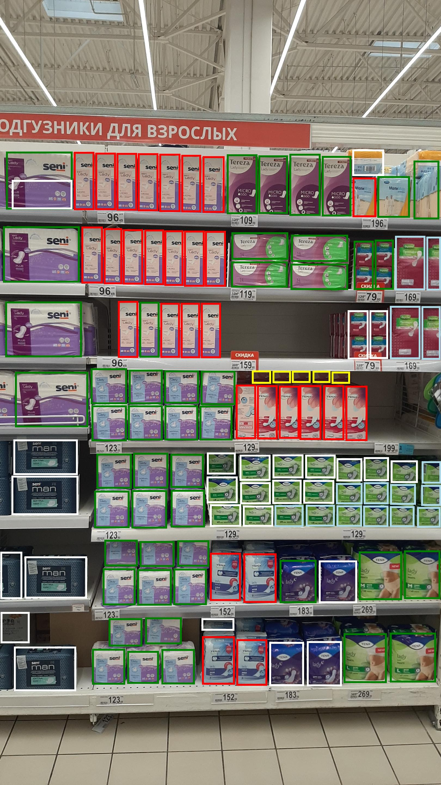

<h1>Grouped Detection [YOLOV5 + FEWSHOT CLASSIFICATION]</h1>
The Grouped Detection of Objects utilizes the YOLO algorithm to perform accurate object detection in images. After detecting the objects, I crop specific regions of interest and feed them into a Swin Transformer-backboned few-shot network, which helps in performing efficient few-shot classification. To determine the optimal number of clusters, I incorporate the Elbow Method along with K-means clustering, ensuring the model is well-tuned. For seamless deployment, I use FastAPI to create a robust microservice that handles real-time predictions and can be easily scaled for various use cases.

